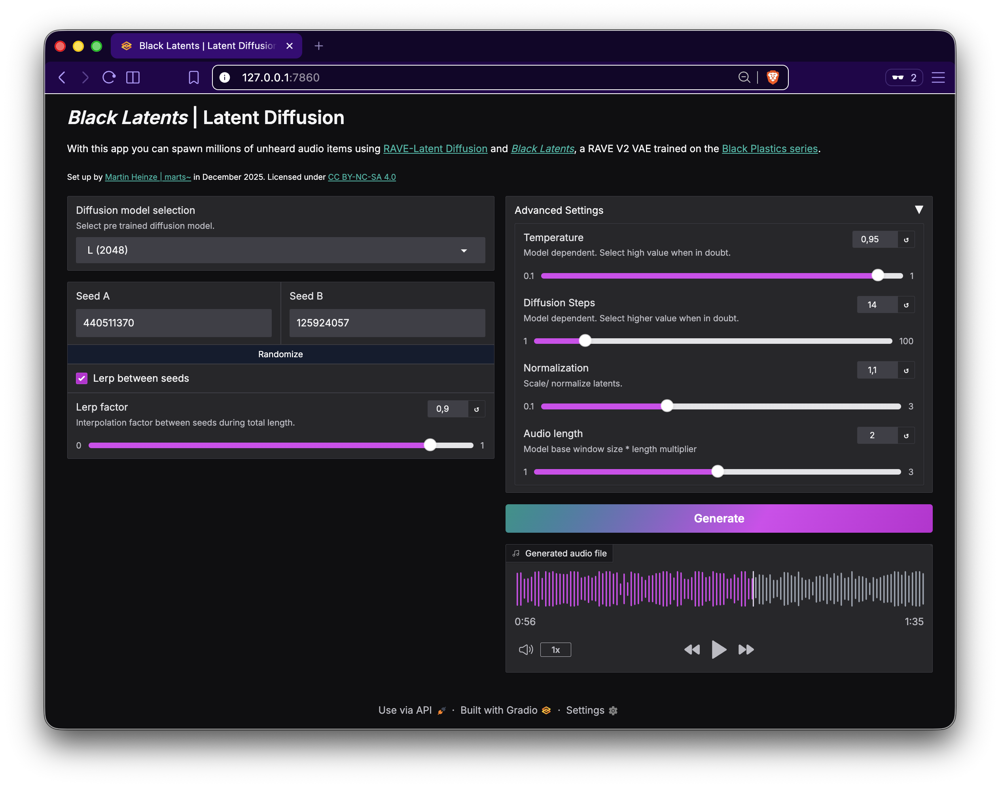

# _Black Latents_ | Latent Diffusion
A gradio application that allows you to spawn audio items from [_Black Latents_](https://forum.ircam.fr/projects/detail/black-latents), a RAVE V2 VAE trained on the [Black Plastics series](https://soundcloud.com/martsman/sets/black-plastics-series) series using RAVE-Latent Diffusion models.



A demo version of this application is accessible on [Huggingface](https://huggingface.co/spaces/martstilde/black-latents-latent-diffusion-demo).

Author: [Martin Heinze | `marts~`](https://martstil.de).

Initial commit year: 2025

---

## Setup app for local inference

Create and activate a new conda environment e.g.:

```bash
conda create -n black-latents-latent-diffusion-app python=3.11
conda activate black-latents-latent-diffusion-app
```

Clone this repository, run pip install on requirements.txt

```bash
git clone https://github.com/devstermarts/black-latents-latent-diffusion-app.git
cd black-latents-latent-diffusion-app
pip install .
```

Start the app with...

```bash
gradio app.py
```
Open app in browser (usually localhost:7860). 

## Request model access and download
To use the app, you need both diffusion models and the _Black Latents_ VAE from the [model hub on on Huggingface](https://huggingface.co/martstilde/black-latents-latent-diffusion-models). The hub is public, but you're required to request access.

After you've been granted access, create an access token on Huggingface. Next: register your token to your shell configuration file and reload. 

```bash
export HF_TOKEN="your_hugging_face_access_token_here" # Add token to shell configuration
source ~/.bashrc # Reload 
echo $HF_TOKEN # Double check if the token has been set. 
```

*The models will be downloaded to your local machine (>13GB) on the app's first request - expect some initial loading time.*

## Credits

- Diffusion models have been trained using [RAVE-Latent Diffusion (Flex'Ed)](https://github.com/devstermarts/RAVE-Latent-Diffusion-Flex-ed), a fork of the original repository [RAVE-Latent-Diffusion](https://github.com/moiseshorta/RAVE-Latent-Diffusion) by Moisés Horta Valenzuela.
- [RAVE](https://github.com/acids-ircam/RAVE) is a variational autoencoder for fast and high-quality neural audio synthesis by Antoine Caillon and Philippe Esling (acids/IRCAM)

## License
[_Black Latents_ | Latent Diffusion](https://github.com/devstermarts/black-latents-latent-diffusion-app) © 2025 by [Martin Heinze](https://github.com/devstermarts) is licensed under [CC BY-NC-SA 4.0](https://creativecommons.org/licenses/by-nc-sa/4.0/).
